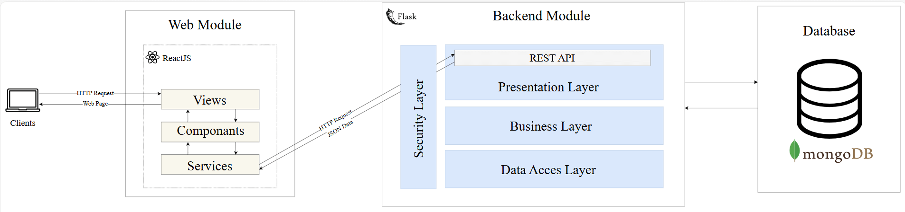

# PVInsight: A Novel Web-Based Platform for Streamlined Photovoltaic Power Prediction


### Overview

**PVInsight** is an advanced web-based platform developed to streamline the prediction and management of photovoltaic (PV) power generation using Artificial Intelligence (AI). This project is tailored to address challenges faced by researchers in handling large volumes of energy data, enabling efficient preprocessing, anomaly detection, and energy forecasting.

Designed with a user-friendly interface and leveraging cutting-edge technologies, PVInsight empowers researchers to automate data workflows, visualize anomalies, and predict future energy outputs of solar panels.

## Table of Contents

1. [Project Structure](#project-structure)
2. [System Architecture](#system-architecture)
3. [Core Functionalities](#core-functionalities)
4. [Installation and Setup](#installation-and-setup)
5. [Default User Accounts](#default-user-accounts)
6. [Illustrative Examples](#illustrative-examples)
7. [Video Demonstration](#video-demonstration)
8. [Future Enhancements](#future-enhancements)

## Project Structure

The PVInsight project is organized into two main directories:

```
PVInsight/
│
├── Frontend/            # React.js Web Application
│   ├── src/
│   └── package.json
│
└── Backend/             # Flask Application
    ├── app/
    └── requirements.txt
```

### System Architecture



### Core Functionalities

1. Data Preprocessing

   - Detection and handling of missing, null, and anomalous values
   - Data normalization, encoding, and filtering for enhanced model compatibility
2. Prediction & Analysis

   - Predict energy generation using machine learning models
   - Visualize predicted vs. actual data with comprehensive metrics
3. User Roles

   - **Admin**: Manage user roles, monitor system stats, and maintain system integrity
   - **Researcher**: Import datasets, preprocess data, perform predictions, and generate reports
   - **AI Supervisor**: Manage and fine-tune predictive models and preprocessing scripts
4. Real-Time Insights

   - Visualize data trends and monitor real-time energy production for decision-making
5. Reports & Dashboards

   - Generate detailed reports for data quality, anomaly detection, and prediction results
   - Interactive dashboards for data exploration and visualization

## Installation and Setup

### Prerequisites

Choose one of the following setup options:

#### Option 1: Local Setup

- Node.js (version 20.10.0)
- Python (version 3.11.3)
- MongoDB

#### Option 2: Docker Setup

- Docker Engine
- Docker Compose

### Option 1: Local Setup

1. **Clone the Project**

```bash
git clone https://github.com/AbderrahmaneOd/PVInsight.git
cd PVInsight
```

2. **Backend Setup**

```bash
# Navigate to Backend directory
cd ./Backend

# Create .env file from the template
cp .env.example .env
# Configure MongoDB connection in .env

# Install dependencies
pip install -r requirements.txt

# Initialize the database with default user accounts
python ./app/init_db.py

# Run Flask application
flask run --reload
```

3. **Frontend Setup**

```bash
# Navigate to Frontend directory
cd ./Frontend

# Create .env file from template
cp .env.example .env

# Install dependencies
npm install

# Run development server
npm run dev
```

### Option 2: Docker Setup

1. **Clone the Project**

```bash
git clone https://github.com/AbderrahmaneOd/PVInsight.git
cd PVInsight
```

2. **Build and Run with Docker Compose**

```bash
# Build and start all services
docker-compose up --build

# To run in detached mode
docker-compose up -d
```

The application will be accessible at:

- Frontend: `http://localhost:5173`
- Backend: `http://localhost:5000`

## Default User Accounts

### Administrator

- Username: `admin`
- Password: `admin_pass`

### AI Manager

- Username: `ai_manager`
- Password: `ai_manager_pass`

### Researcher

- Username: `researcher`
- Password: `researcher_pass`

## Illustrative Examples

## Video Demonstration

## Future Enhancements

- Automated report generation for preprocessed data and predictions
- Mobile application for data visualization
- Advanced script management for preprocessing customization
- Enhanced machine learning model selection and customization

## Contributors

| Links\Names | Mohammed Belkarradi                                                                                                                     | Abderrahmane Ouaday                                                                                                           |
| ----------- | --------------------------------------------------------------------------------------------------------------------------------------- | ----------------------------------------------------------------------------------------------------------------------------- |
| GitHub      |  [GitHub](https://github.com/BELKARRADI)                                            |  [GitHub](https://github.com/AbderrahmaneOd)                              |
| LinkedIn    |  [LinkedIn](https://www.linkedin.com/in/mohammed-belkarradi-770954211/) |  [LinkedIn](https://www.linkedin.com/in/abderrahmane-ouaday/) |
| Website     |  [Website](#)                                                                          |  [Website](https://aouaday.me/)                                              |

## License

This project is licensed under the MIT License - see the LICENSE file for details.
